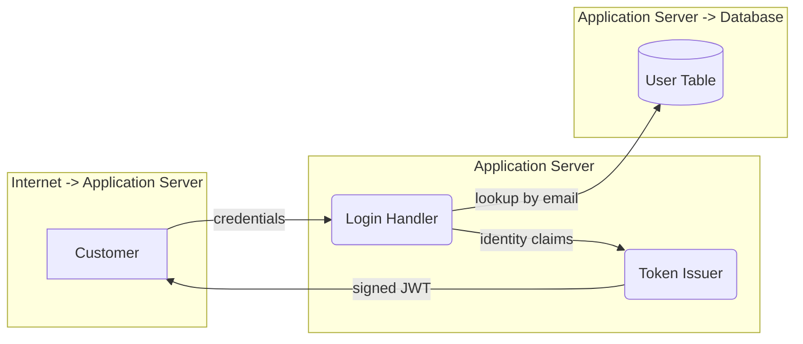

# Stage contracts

What each stage hands the next. Stage 3 (STRIDE analysis) is built against these
shapes; stages 1 and 2 own producing them.

```
stage 1  characterize app  ──▶  use cases            ──▶  output/use-cases.json
stage 2  draw DFDs         ──▶  use cases + mermaid  ──▶  output/use-cases.json  (enriched)
stage 3  STRIDE skills     ──▶  threats              ──▶  output/stride/*.json
```

Stage 2 enriches stage 1's file rather than inventing a new one, so there is a single
artifact to pass along and a single thing to debug.

---

## Stage 1 → Stage 2: use cases

Scope is **authentication**, so aim for the handful of flows that decide who someone
is: sign-in, registration, password reset, token refresh, logout, MFA enrollment, OAuth
callback. Six to eight is plenty; each one costs six agent calls downstream.

```json
{
  "use_cases": [
    {
      "id": "UC-LOGIN",
      "name": "Registered customer signs in with email and password",
      "description": "A customer submits credentials to the login endpoint. The application verifies them against the user store and issues a signed token used by every subsequent authenticated request.",
      "entry_points": ["POST /rest/user/login"],
      "source_refs": ["routes/login.ts", "lib/insecurity.ts", "models/user.ts"]
    }
  ]
}
```

| Field | Required | Notes |
|---|---|---|
| `id` | **yes** | Stable across runs — it becomes part of every threat ID, so a changed id breaks run-to-run diffing. Convention: `UC-SCREAMING-KEBAB`. |
| `name` | recommended | One line. Appears verbatim in the stage 3 prompt. |
| `description` | recommended | Two or three sentences of what actually happens. The agent's orientation before it reads code. |
| `entry_points` | optional | Routes or handlers. Useful to stage 2, ignored by stage 3. |
| `source_refs` | optional | Files stage 1 found relevant. Stage 2 turns these into `file_hints`. |

Stage 3 runs on this alone, but with no diagram it has no elements to iterate and falls
back to generic advice — the exact failure the per-element structure exists to prevent.
Treat stage 1 output as incomplete input.

---

## Stage 2 → Stage 3: use cases with Mermaid DFDs

Same file, with a `mermaid` string added to each use case. This is the shape stage 3
actually reads.

```json
{
  "use_cases": [
    {
      "id": "UC-LOGIN",
      "name": "Registered customer signs in with email and password",
      "description": "A customer submits credentials to the login endpoint...",

      "mermaid": "flowchart LR\n  subgraph TB_NET[Internet -> Application Server]\n    CUST[Customer]\n  end\n  subgraph TB_APP[Application Server]\n    LOGIN(Login Handler)\n    TOKEN(Token Issuer)\n  end\n  subgraph TB_DB[Application Server -> Database]\n    USERS[(User Table)]\n  end\n  CUST -->|credentials| LOGIN\n  LOGIN -->|lookup by email| USERS\n  LOGIN -->|identity claims| TOKEN\n  TOKEN -->|signed JWT| CUST",

      "file_hints": {
        "LOGIN": ["routes/login.ts"],
        "TOKEN": ["lib/insecurity.ts"],
        "USERS": ["models/user.ts"]
      }
    }
  ]
}
```

Unescaped, that diagram is:



### Node shape carries the element type

This is the load-bearing part of the whole contract. Mermaid has no notion of "this box
is a data store", but each STRIDE skill analyzes only certain element types — so the
type has to come from somewhere. It comes from the **shape**, following classic DFD
notation:

| Element type | Shape | Mermaid | Example |
|---|---|---|---|
| External entity | rectangle | `id[Name]` | `CUST[Customer]` |
| Process | rounded | `id(Name)` | `LOGIN(Login Handler)` |
| Data store | cylinder | `id[(Name)]` | `USERS[(User Table)]` |
| Data flow | labelled arrow | `a -->\|label\| b` | `CUST -->\|credentials\| LOGIN` |
| Trust boundary | subgraph | `subgraph ID[Name] ... end` | `subgraph TB_NET[Internet -> App]` |

Tolerated variants, so a slightly-off diagram still parses: `[/Name/]` and `[\Name\]`
read as external entities, `([Name])` and `((Name))` as processes, `{Name}` and
`{{Name}}` as data stores — though `[(Name)]` is preferred, because a diamond means
"decision" to anyone reading the rendered picture.

### The one mistake that matters

`[Name]` is also Mermaid's **default** shape. A diagram that ignores the convention is
all rectangles, so every element reads as an external entity — and five of the six
letters return nothing, silently. Stage 3 detects this and warns:

```
diagram warning [UC-LOGIN]: all 7 nodes are plain rectangles, so every one reads as an
external entity. That is almost certainly a diagram that did not follow the shape
convention — processes should be (Name) and data stores [(Name)].
```

Put the shape table in stage 2's prompt verbatim, and check the warnings on a dry run.

### Which letters see which elements

| Element type | Analyzed by |
|---|---|
| External entity | S |
| Process | S T R I D E |
| Data store | T R I D |
| Data flow | T I D |
| Trust boundary | context only, not iterated |

Two consequences worth designing around: **Elevation of Privilege analyzes processes
only**, so a diagram with no rounded nodes produces zero E findings; and **Spoofing needs
external entities or processes**. Draw the shapes correctly or whole letters go quiet.

### `file_hints`

Mermaid cannot carry a source location per node, so hints ride alongside as a map keyed
by **node id** (the `LOGIN` in `LOGIN(Login Handler)`), or by element name if you prefer.
Values are a string or a list of strings.

Optional, but it is the biggest single lever on evidence quality — it points the agent at
the file instead of making it search, which directly determines how many findings come
back at `confidence: "high"` with a citable line.

### Trust boundaries

Wrap elements in a `subgraph`. Stage 3 records which boundary each element sits inside and
passes it through to the threat record, so "crosses the Internet → Application Server
boundary" appears in the output. Name boundaries for the crossing, not the zone —
`Internet -> Application Server` beats `External`.

---

## What stage 3 requires versus tolerates

The loader is deliberately forgiving so a missing field degrades quality rather than
ending the run:

- **Hard requirement:** a top-level list of use cases (either `{"use_cases": [...]}` or a
  bare array), and every use case has an `id`. Anything else is a startup error.
- **Everything else is optional.** No `mermaid` produces a note in the prompt rather than
  a crash; no `description` just yields a thinner prompt.
- **A structured `dfd` object is still accepted** as a fallback, with `external_entities`,
  `processes`, `data_stores`, `data_flows`, `trust_boundaries` keys. Mermaid wins if both
  are present.
- **Unknown keys are ignored,** so stages 1 and 2 can carry extra fields without
  coordinating with stage 3.

---

## How to check your output without spending a token

`--dry-run` renders the exact prompts stage 3 will send, and needs neither AWS credentials
nor the deepagents install. Diagram warnings print first, on stderr:

```bash
python -m main.stage3_stride --use-cases output/use-cases.json --dry-run

# one call, while iterating
python -m main.stage3_stride --use-cases output/use-cases.json \
    --dry-run --only-use-case UC-LOGIN --only-letter R
```

What to look for in the output:

- **Diagram warnings** — any at all mean the parse is degraded. Fix them first.
- **The typed inventory** — every element should appear under the right heading. If your
  Login Handler is listed under "External entities", it is drawn `[...]` instead of `(...)`.
- **Empty inventory** — the diagram did not parse. Check for a `flowchart` header line.

A complete two-use-case example lives at
[`tests/fixtures/example_use_cases.json`](../tests/fixtures/example_use_cases.json) — copy
it as a starting point.

---

## Stage 3 → Stage 4: threats

For whoever writes the report. Stage 3 writes one file per call to
`output/stride/<use-case-id>-<letter>.json`, plus a merged
`output/stride/all_threats.json` holding `{"threats": [...]}`.

Each threat carries `id`, `stride`, `title`, `dfd_element`, `trust_boundary`,
`description`, `attack_scenario`, `evidence` (file, line, snippet), `existing_mitigations`,
`status`, `likelihood`, `impact`, `risk`, `confidence`, `cwe`, `recommendation`. The full
definition and allowed values are in [`main/contract.py`](../main/contract.py); import
`validate_merged` and `coverage_table` from there rather than re-deriving them.

Two properties the report can rely on:

- **`risk` is derived**, never assigned — `likelihood` × `impact` through a fixed matrix,
  identical in all six skills. Sorting by it is meaningful.
- **`confidence: "high"` guarantees at least one evidence entry** with a real file and line.
  Filtering to high-confidence findings gives you the citable subset.
