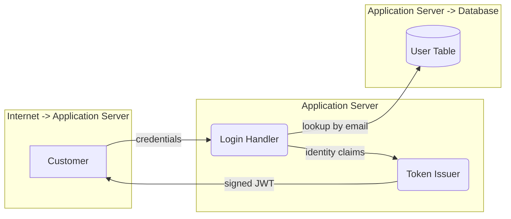

# Stage contracts

What each stage hands the next. Stage 3 (STRIDE analysis) is built against these
shapes; stages 1 and 2 own producing them.

```
output/<repo>/
  use-cases/<id>.json      stage 1 — name, description, entry points
  graphs/<id>.json         stage 2 — the typed node/edge graph
  dfds/<id>.mmd            stage 2 — the Mermaid diagram, rendered from the graph
  threats/<id>/<L>.json    stage 3 — one file per agent call, the cache unit
  threats/<id>.json        stage 3 — merged per use case, what stage 4 reads
  report.md                stage 4 — the deliverable, and the chatbot's corpus
```

**A target is keyed by its repository name**, resolved from the git remote — so a Juice
Shop clone lives at `repo/juice-shop` and writes to `output/juice-shop`, whatever the
local directory is called. Several targets can be analyzed side by side, and two people
who cloned differently produce the same path. `main/target.py` does the resolution and
falls back to the directory name for a non-git source drop.

Run the whole chain with `python main.py --repo repo/juice-shop`, or pass a git URL and
it is cloned on first use. Every stage also runs standalone against the same directory.

**The filename is the use case id.** Stages never have to agree on anything but a
stem: stage 2 writes `dfds/UC-LOGIN.mmd` because stage 1 wrote
`use-cases/UC-LOGIN.json`. Stage 3 rejects a file whose `id` field disagrees with its
filename rather than guessing which is right. Ids must be filesystem-safe — no slashes
or spaces. Convention: `UC-SCREAMING-KEBAB`.

**A worked example lives at [`output/_example/`](../output/_example/)** — one target's
complete output in this exact layout, with each file documenting its own contract. Point
a stage at it (`--output output/_example`) to smoke-test without touching a live run.

---

## Stage 1 → `output/use-cases/<id>.json`

Scope is **authentication**, so aim for the handful of flows that decide who someone
is: sign-in, registration, password reset, token refresh, logout, MFA enrollment, OAuth
callback. Six to eight is plenty; each one costs six agent calls downstream.

One file per use case. See [`output/_example/use-cases/UC-LOGIN.json`](../output/_example/use-cases/UC-LOGIN.json).

```json
{
  "id": "UC-LOGIN",
  "name": "Registered customer signs in with email and password",
  "description": "A customer submits credentials to the login endpoint. The application verifies them against the user store and issues a signed token that authorizes every subsequent request.",
  "entry_points": ["POST /rest/user/login"],
  "source_refs": ["routes/login.ts", "lib/insecurity.ts", "models/user.ts"]
}
```

| Field | Required | Notes |
|---|---|---|
| `id` | **yes** | Must equal the filename stem. Stable across runs — it becomes part of every threat id, so changing it breaks run-to-run diffing. |
| `name` | recommended | One line. Appears verbatim in the stage 3 prompt. |
| `description` | recommended | Two or three sentences on what actually happens. The agent's orientation before it reads code. |
| `entry_points` | optional | Routes or handlers. Useful to stage 2, ignored by stage 3. |
| `source_refs` | optional | Files stage 1 found relevant. Stage 2 turns these into `%% file:` hints. |

Any other key is ignored, so stages can carry extra fields without coordinating.

Stage 3 runs on this alone, but with no diagram it has no elements to iterate and falls
back to generic advice — the exact failure the per-element structure exists to prevent.
Treat stage 1 output as incomplete input.

---

## Stage 2 → `<output>/graphs/<id>.json` and `<output>/dfds/<id>.mmd`

Stage 2 runs in two chained phases, each an orchestrator fanning out to one subagent
per file: a use case becomes a typed node/edge graph, and the graph is rendered to
Mermaid. Keeping the graph is what makes the rendering checkable — every diagram is
parsed back before the stage exits, and one whose shapes came out wrong is re-rendered
from its graph deterministically rather than left to degrade stage 3 silently.

The graph's node types are the same four the skills iterate, and each node may carry a
`file` copied from the use case's `source_refs`, which becomes a `%% file:` hint.

A Mermaid flowchart, one file per use case, named to match the stem in `use-cases/`.
See [`output/_example/dfds/UC-LOGIN.mmd`](../output/_example/dfds/UC-LOGIN.mmd).



### Node shape carries the element type

This is the load-bearing part of the whole contract. Mermaid has no notion of "this box
is a data store", but each STRIDE skill analyzes only certain element types — so the
type has to come from somewhere. It comes from the **shape**, following classic DFD
notation:

| Element type | Shape | Mermaid | Example |
|---|---|---|---|
| External entity | rectangle | `id[Name]` | `CUST[Customer]` |
| Process | rounded | `id(Name)` | `LOGIN(Login Handler)` |
| Data store | cylinder | `id[(Name)]` | `USERS[(User Table)]` |
| Data flow | labelled arrow | `a -->\|label\| b` | `CUST -->\|credentials\| LOGIN` |
| Trust boundary | subgraph | `subgraph ID[Name] ... end` | `subgraph TB_NET[Internet -> App]` |

Tolerated variants, so a slightly-off diagram still parses: `[/Name/]` and `[\Name\]`
read as external entities, `([Name])` and `((Name))` as processes, `{Name}` and
`{{Name}}` as data stores — though `[(Name)]` is preferred, because a diamond means
"decision" to anyone reading the rendered picture.

### The one mistake that matters

`[Name]` is also Mermaid's **default** shape. A diagram that ignores the convention is
all rectangles, so every element reads as an external entity — and five of the six
letters return nothing, silently. Stage 3 detects this and warns:

```
diagram warning [UC-LOGIN]: all 7 nodes are plain rectangles, so every one reads as an
external entity. That is almost certainly a diagram that did not follow the shape
convention — processes should be (Name) and data stores [(Name)].
```

Put the shape table in stage 2's prompt verbatim, and check the warnings on a dry run.

### Which letters see which elements

| Element type | Analyzed by |
|---|---|
| External entity | S |
| Process | S T R I D E |
| Data store | T R I D |
| Data flow | T I D |
| Trust boundary | context only, not iterated |

Two consequences worth designing around: **Elevation of Privilege analyzes processes
only**, so a diagram with no rounded nodes produces zero E findings; and **Spoofing needs
external entities or processes**. Draw the shapes correctly or whole letters go quiet.

### Source locations

A node cannot carry a file path, so hints ride in Mermaid comments — which render as
nothing and keep one artifact per diagram:

```
%% file: LOGIN routes/login.ts
%% file: USERS models/user.ts, models/session.ts
```

The id is the node id (the `LOGIN` in `LOGIN(Login Handler)`), followed by one or more
paths. A hint naming a node that is never drawn is warned about and ignored.

Optional, but the biggest single lever on evidence quality — it points the agent at the
file instead of making it search, which directly determines how many findings come back
at `confidence: "high"` with a citable line.

### Trust boundaries

Wrap elements in a `subgraph`. Stage 3 records which boundary each element sits inside
and passes it through to the threat record, so "crosses the Internet → Application
Server boundary" appears in the output. Name boundaries for the crossing, not the zone —
`Internet -> Application Server` beats `External`.

---

## Stage 3 → `output/threats/`

Stage 3 makes one agent call per use case per letter and writes each to
`threats/<id>/<LETTER>.json` — see
[`output/_example/threats/UC-LOGIN/S.json`](../output/_example/threats/UC-LOGIN/S.json). An existing file
is skipped unless `--force`, so re-running one letter costs one call rather than six.

It then merges all six into `threats/<id>.json` — see
[`output/_example/threats/UC-LOGIN.json`](../output/_example/threats/UC-LOGIN.json). **Stage 4 reads only
the merged file**; the per-letter directory is stage 3's working state.

Each threat carries `id`, `stride`, `title`, `dfd_element`, `trust_boundary`,
`description`, `attack_scenario`, `evidence` (file, line, snippet), `existing_mitigations`,
`status`, `likelihood`, `impact`, `risk`, `confidence`, `cwe`, `recommendation`. The full
definition and allowed values are in [`main/contract.py`](../main/contract.py); import
`validate_merged` and `coverage_table` from there rather than re-deriving them.

Two properties the report can rely on:

- **`risk` is derived**, never assigned — `likelihood` × `impact` through a fixed matrix,
  identical in all six skills. Sorting by it is meaningful.
- **`confidence: "high"` guarantees at least one evidence entry** with a real file and
  line. Filtering to it gives you the citable subset.

---

## What stage 3 requires versus tolerates

The loader is deliberately forgiving so a missing field degrades quality rather than
ending the run:

- **Hard requirements:** `output/use-cases/` exists and holds at least one non-`_` JSON
  file, each an object whose `id` matches its filename. Anything else is a startup error.
- **A missing diagram** warns and produces a prompt with no elements, rather than crashing.
- **A missing `description`** just yields a thinner prompt.
- **A structured `dfd` object** on the use case JSON is still accepted as a fallback, with
  `external_entities`, `processes`, `data_stores`, `data_flows`, `trust_boundaries` keys.
  The `.mmd` file wins if both exist.
- **Unknown keys are ignored.**

---

## How to check your output without spending a token

`--dry-run` renders the exact prompts stage 3 will send, and needs neither AWS credentials
nor the deepagents install. Diagram warnings print first, on stderr:

```bash
python -m main.stage3_stride --dry-run

# one call, while iterating
python -m main.stage3_stride --dry-run --only-use-case UC-LOGIN --only-letter R
```

What to look for:

- **Diagram warnings** — any at all mean the parse is degraded. Fix them first.
- **The typed inventory** — every element should appear under the right heading. If your
  Login Handler is listed under "External entities", it is drawn `[...]` not `(...)`.
- **`implemented in ...`** next to an element — that is a `%% file:` hint landing. Missing
  hints are the difference between a citable finding and a vague one.
- **Empty inventory** — the diagram did not parse. Check for a `flowchart` header line.

Then the real run:

```bash
python -m main.stage3_stride --repo ./juice-shop
```

---

## Stage 4 → `output/report.md`

```bash
python -m main.stage4_report                    # deterministic, no model call
python -m main.stage4_report --summarize        # adds an LLM executive summary
```

Reads `threats/<id>.json`, `use-cases/<id>.json` and `dfds/<id>.mmd`; writes one markdown
document with the severity counts, the STRIDE coverage matrix, each DFD inlined as a
`mermaid` fence, and every finding sorted worst-first with its evidence.

Assembly is deterministic — same inputs, byte-identical output — so the consistency claim
the report makes about itself is true, and the demo cannot fail on a model call. Only
`--summarize` invokes a model, and a failed summary is skipped rather than losing the
report.

## Chatting with the result

```bash
python -m main.chatbot                                     # interactive
python -m main.chatbot --ask "What is the worst finding in the login flow?"
```

A DeepAgent rooted at the project directory, so it reads `output/` and the target clone
directly — no vector store, nothing to re-index after a stage 3 re-run. Run stage 4 first:
`report.md` is the summary layer of its corpus, so answers line up with what the report
says.

It is prompted to cite a threat id or a `file:line` for every claim, to treat
`status: mitigated` as evidence of a control rather than a finding, and to decline when
the corpus does not cover the question rather than infer a threat that was never raised.
