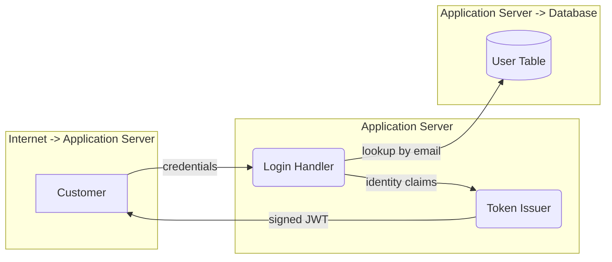

# Threat model — OWASP Juice Shop (example)

Authentication scope · static analysis · 2026-08-11

3 threats across 1 use case(s), analyzed against all six STRIDE categories.

## Findings at a glance

| Severity | Count |
|---|---:|
| Critical | 1 |
| High | 2 |
| Medium | 0 |
| Low | 0 |
| **Total** | **3** |

### Coverage by STRIDE category

Every use case is analyzed by all six categories in separate passes, so a zero is a
considered result rather than a gap in the method.

| Use case | S | T | R | I | D | E | Total |
|---|---|---|---|---|---|---|---|
| UC-LOGIN | 1 | 0 | 1 | 1 | 0 | 0 | 3 |

S Spoofing · T Tampering · R Repudiation · I Information disclosure · D Denial of service · E Elevation of privilege

### Evidence

- 3 high confidence, 0 medium, 0 low
- 3 of 3 threats cite a specific file and line

A high-confidence threat is guaranteed to cite source; a low-confidence one applies to the
element by type but no supporting code was located. Low-confidence entries are retained
rather than dropped so the reader can judge them.

## Method

Static analysis of the application source. No running instance was exercised, so
findings describe reachable code paths rather than confirmed exploits.

The pipeline runs in stages, each writing files the next reads:

1. **Characterize** — the codebase is surveyed and authentication use cases identified.
2. **Model** — a data flow diagram is drawn per use case, with elements typed as external
   entities, processes, data stores and data flows, and grouped by trust boundary.
3. **Analyze** — six independent agent passes per use case, one per STRIDE category, each
   loading a single skill scoped to that category. Coverage is guaranteed by the loop
   rather than left to one agent's judgement.
4. **Report** — this document, assembled deterministically from the stage 3 output.

### Consistency

- Each STRIDE pass loads exactly one skill, so every category receives equal attention.
- Severity is **derived**, never assigned: likelihood × impact through a fixed matrix
  identical across all six skills. Two runs cannot disagree about what `high × high` means.
- Every agent response is validated against a shared JSON contract before it is accepted;
  a response that violates it is returned to the model with its own error list and retried.
- Threat identifiers are derived from the use case and category, so runs can be diffed.
- Model: `us.anthropic.claude-haiku-4-5-20251001-v1:0`, temperature 0.3.

### Limitations

- Static analysis only. No dynamic testing, no exploitation, no runtime confirmation.
- Scope is authentication: 1 use case(s). Other areas of the application
  were not analyzed.
- Findings are machine-generated. High-confidence entries cite a file and line and can be
  checked directly; low-confidence entries are hypotheses worth triaging, not conclusions.

## UC-LOGIN — Registered customer signs in with email and password

A customer submits credentials to the login endpoint. The application verifies them against the user store and issues a signed token that authorizes every subsequent request.

**Entry points:** `POST /rest/user/login`

### Data flow



### Threats

| ID | Severity | Category | Element | Status |
|---|---|---|---|---|
| T-UC-LOGIN-S-001 | Critical | Spoofing | Login Handler | Unmitigated |
| T-UC-LOGIN-I-001 | High | Information Disclosure | User Table | Unmitigated |
| T-UC-LOGIN-R-001 | High | Repudiation | Login Handler | Unmitigated |

### Detail

#### T-UC-LOGIN-S-001 — Credential stuffing against an unthrottled login endpoint

**Critical** · Spoofing · Login Handler (process) · Unmitigated · high confidence

*Crosses:* Internet -> Application Server

The login route compares credentials with no rate limit, lockout, or CAPTCHA, so an attacker may guess passwords without bound.

**Attack scenario.** The attacker replays a breach corpus of email/password pairs against POST /rest/user/login. With no throttling, a few thousand requests surface accounts whose owners reused a password.

*routes/login.ts:31*

```
const user = await models.User.findOne({ where: { email, password: hash(password) } })
```

**Recommendation.** Rate limit the login route by both source address and target account, and add escalating delay after repeated failures.

*CWE-307, CWE-287*

#### T-UC-LOGIN-I-001 — Passwords stored with a fast unsalted hash

**High** · Information Disclosure · User Table (data store) · Unmitigated · high confidence

*Crosses:* Application Server -> Database

Credentials are hashed with MD5, which is fast and unsalted, so a single database read compromises every account.

**Attack scenario.** An attacker who obtains the user table through any read primitive recovers common passwords with a commodity GPU in seconds, then reuses them here and on other services.

*models/user.ts:31*

```
return crypto.createHash('md5').update(password).digest('hex')
```

**Recommendation.** Replace with bcrypt, scrypt, or argon2id at a tuned work factor, and rehash on next successful login.

*CWE-916, CWE-327*

#### T-UC-LOGIN-R-001 — Authentication outcomes are never logged

**High** · Repudiation · Login Handler (process) · Unmitigated · high confidence

*Crosses:* Internet -> Application Server

Neither successful nor failed logins produce an audit record, so an account takeover cannot be distinguished after the fact from legitimate use.

**Attack scenario.** An attacker authenticates with stolen credentials and changes the account email. With no log of either action the operator cannot establish when access began, or whether the owner did it themselves.

*routes/login.ts:44*

```
res.json({ authentication: { token, umail: user.email } })
```

**Recommendation.** Emit a structured record for both outcomes carrying user id, source address, UTC timestamp, and a request correlator, to an append-only sink.

*CWE-778*

## Notes on this run

- use case 'UC-LOGIN' has no threats for letter(s) D, E, T — confirm those skill calls ran and returned an empty list on purpose

---

Generated by the BS-Squared threat modelling pipeline. Regenerate with `python -m main.stage4_report`.
